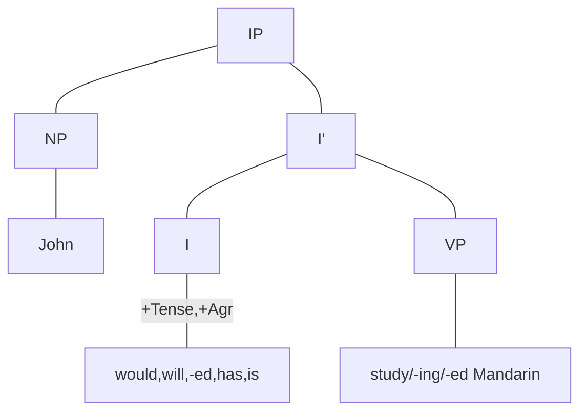

# X-阶标理论
  ```mermaid
graph TD
A[XP] --- B1[Spec]
A --- B2[X']
B2 --- D1[X]
B2 --- D2[ZP]
  ```
X=N,V,A,P或Adv

分句结构也符合X-阶标图示，有的分句是标句词短语CP，有的是屈折语短语IP：
  ```mermaid
graph TD
A[IP] --- B1[Spec]
A --- B2[I']
B2 --- D1[I]
B2 --- D2[VP]
  ```

  ```mermaid
graph TD
A[IP] --- B1[Spec]
A --- B2[I']
B2 --- D1[I]
B2 --- D2[ZP]
  ```

ZP=NP,AP或PP

  ```mermaid
graph TD
A[CP] --- B1[Spec]
A --- B2[C']
B2 --- D1[C]
B2 --- D2[IP]
  ```
五种实义短语结构NP,VP,AP,PP和AdvP以实义语类为中心语，称为实义性投射；分句结构CP和IP以功能语类为中心语，称为功能性投射。


## 1.1 非标句词分句
  would、will、和-ed都可以视为表示时态的语素，区别在于前两者是自由语素，后者是粘着语素。因此将这些语速进行抽象概括，都看作动词的屈折变化形式，并成为屈折词，记作INFL或I。is和has既有体态意义也具有时态意义，因此也具有[+Tense]的特征，此外这两个词还表示主语和动词在数和人称上的一致关系，具有[+Agr]的特征。所有的屈折词都具有一致意义。


  而对于不定式小品词to，其与助动词有同样的分布。因此也可以视其为一种屈折词。不定时分局与时态分句的唯一区别就是前者没有时态变化和人称、数上的变化；也就是说，时态分句的中心于有[+Tense]和[+Agr]的特征，而不定式分句的中心语to缺少这些特征，或者说具有[-Tense]和[-Agr]的特征。
  ```mermaid
graph TD
A[IP] --- B1[NP]
A --- B2[I']
B1 --- E1[John]
B2 --- D1[I]
B2 --- D2[VP]
D1 -- -Tense,-Agr--- E2[to]
D2 --- E3[study Mandarin]

  ```
  综上所述，一个非标句词分句，无论用作独立分句还是嵌入分句，其结构都可以用X-阶标图示来描写：这种分句实际上是一个IP。中心语I与补语VP一起构成I’；主语NP处于标志语位置，与I’一起构成最大投射IP
**非标句分句结构**

  ```mermaid
graph TD
A[IP=S] --- B1[NP]
A --- B2[I']
B2 --- D1[I]
B2 --- D2[VP]
  ```
  在生成语法中，主语被定义为IP的标志语，即在[Spec,Ip]位置上出现的成分，或者说在I’的姐妹节位置上的成分。

## 1.2 标句词分句

  上面把非标句词分句分析为IP。现在分析标句词分句。按照我们的定义，标句词分句由标句词与后接分句构成。
  a.They say [*that*[<sub>IP</sub>John will study Mandarin]]
  b.It is difficult [*for*[<sub>IP</sub>John to study Mandarin]]
  c.I wonder [*if/whether*[<sub>IP</sub>John will study Mandarin]]
  d.John has not decided [*whether*[<sub>IP</sub> ec to study Mandarin]]
  从时态上看，that，if，wehther选择时态分句，for选择不定式分句。另外，如（d）所示，whether也选择以空语类（empty category；ec）充当主语的不定式分句。
  从意义上看，that和for引导的分句具有陈述意义，if和whether引导的分句具有疑问意义。之所以有这种差别，是因为标句词本身具有不同的语义特征。
  这说明，标句词在整个标句词分句中起着决定性作用。因此，标句词分句可以视为以标句词为中心与的短语，即标句词短语（CP）


  ```mermaid
graph TD
A[CP] --- B1[Spec]
A --- B2[C']
B2 --- D1[C]
B2 --- D2[IP]
D1 -- -wh--- E1[that,for]
D2 --- E2[John will study Mandarin,John to study Mandarin]
  ```
  ```mermaid
graph TD
A[CP] --- B1[Spec]
A --- B2[C']
B2 --- D1[C]
B2 --- D2[IP]
D1 -- +wh--- E1[if,whether]
D2 --- E2[John will study Mandarin,ec to study Mandarin]
  ```

## 小句

小句可以分析为隐性的屈折词I为中心语的IP。构成小句的两个成分必须在性和数上保持一致，以此为根据，可以把小句的中心语视为一个隐性的屈折词I，该屈折词支配性[gender]和数[number]两个特征（Haegeman and Gueron)