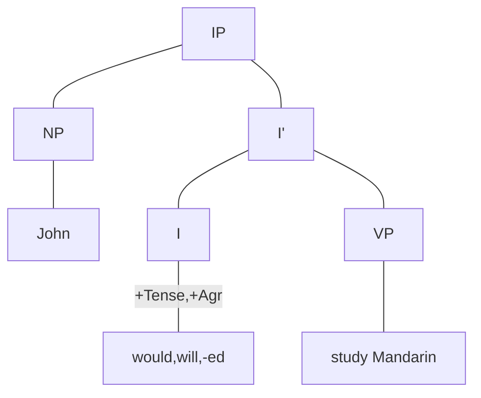

# X-阶标理论
## 1.1 非标句词分句
  would、will、和-ed都可以视为表示时态的语素，区别在于前两者是自由语速，后者是粘着语速。因此将这些语速进行抽象概括，都看作动词的屈折变化形式，并成为屈折词，记作INFL或I。

  而对于不定式小品词to，其与助动词有同样的分布。因此也可以视其为一种屈折词。不定时分局与时态分句的唯一区别就是前者没有时态变化和人称、数上的变化；也就是说，时态分句的中心于有[+Tense]和[+Agr]的特征，而不定式分句的中心语to缺少这些特征，或者说